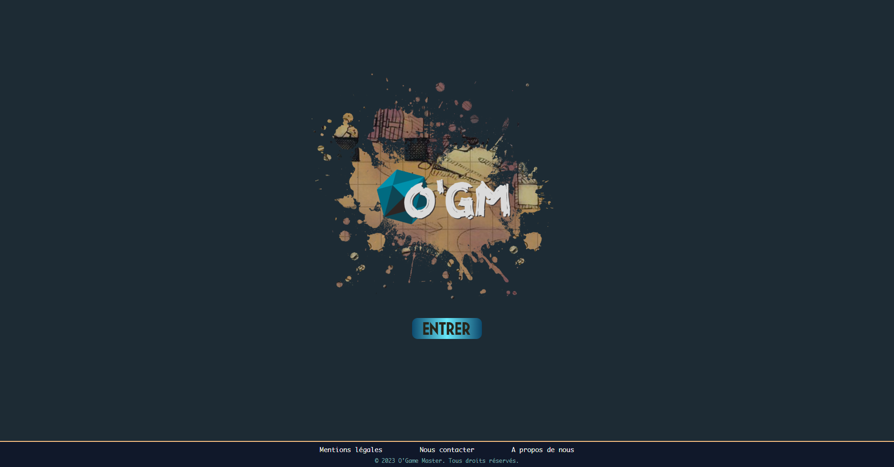

# Back-end REST API for OGM Project

O'clock's apotheosis REST API.
This API accesses a postgresql database to serve a RPG creation and referencement frontend application.

You can find a demo of the project at [ogm.alexisdelahaye.fr](https://ogm.alexisdelahaye.fr).

If you want to access the API, you can use [ogm-api.alexisdelahaye.fr](https://ogm-api.alexisdelahaye.fr).

## Project set up

Prerequisites:

- Having postgresql installed.
- Having sqitch installed.

Steps :

1. Create a user for the postgres database.
2. Create a database for the project and set the owner to the user created in step 1.
3. Copy `.env.example` to `.env` and fill in the values.
4. Copy `sqitch.example.conf` to `sqitch.conf` and fill in the values.
5. Install the dependencies using `npm i -y`.
6. Deploy the database using `npm run db:deploy`.
7. If you want to seed the database, use `npm run db:seed`.
8. Start the server using `npm run start`.

## Project documentation

- All the route documentation is available at the route `/api-docs`.

## License

This project is currently private and not licensed. Please contact me if you want to use it.

## Authors

- [Kevin Bournique](https://github.com/KevinBournique)
- [Alexis Delahaye](https://github.com/AlexisDelahaye7)